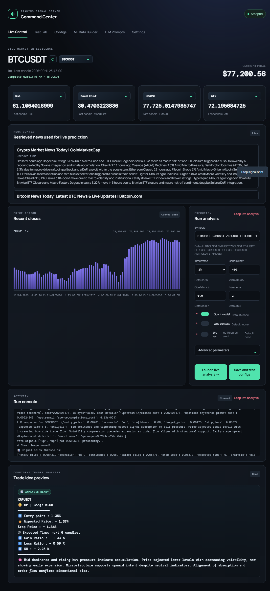
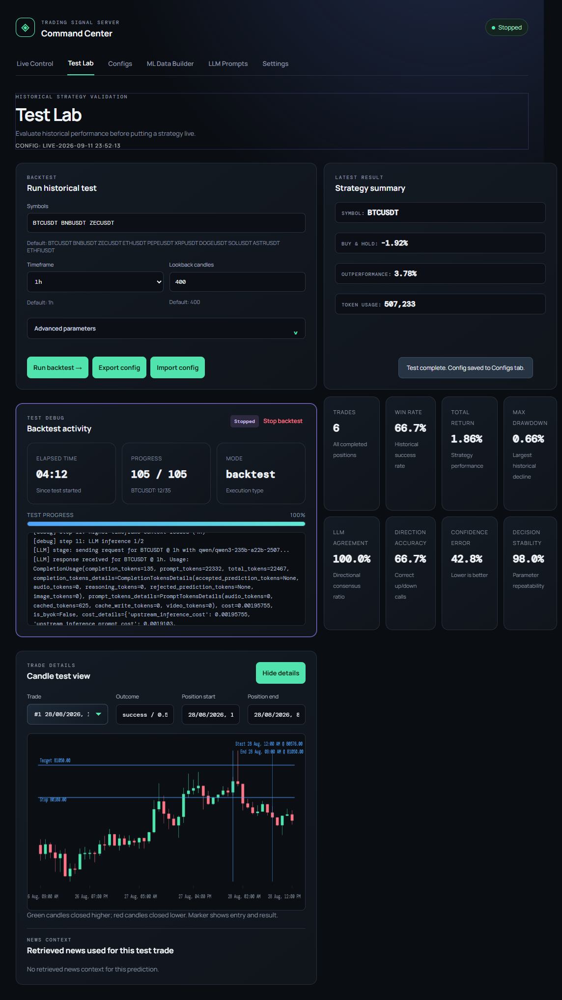
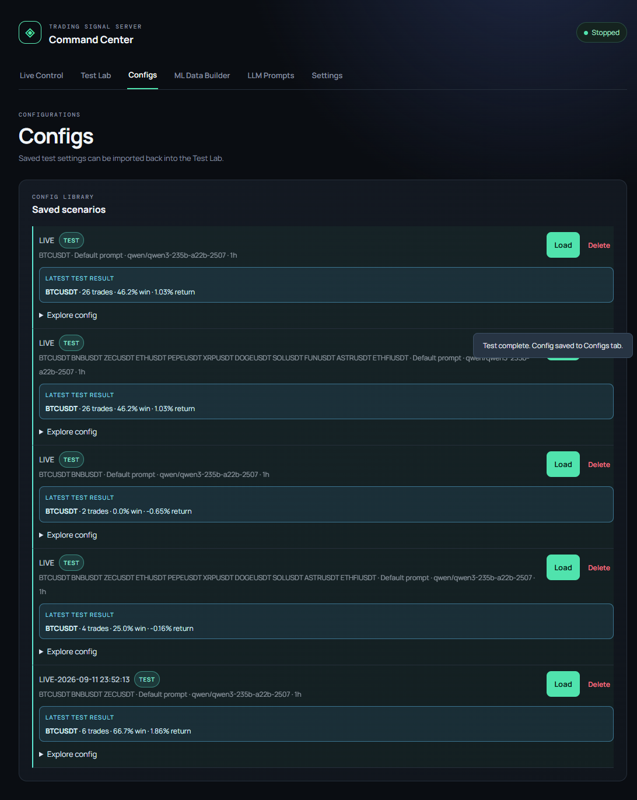
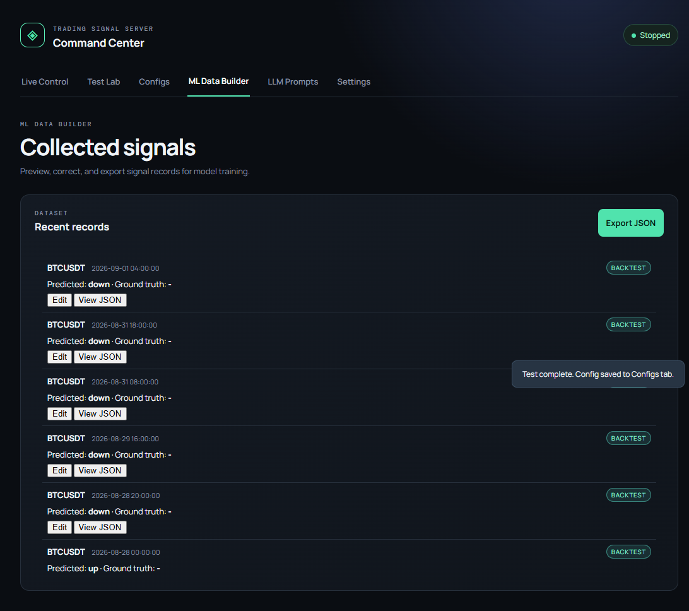

# Trading Signal Intelligence Platform

<p align="center">
  
  
  
  
  
</p>

AI-powered crypto market analysis and signal platform for live signal generation, historical backtesting, quantitative modeling, Telegram alerts, and local dashboard control.

## Key Capabilities

- Public Binance market-data access for candles, order-book metrics, recent trades, and technical-indicator calculations, subject to API availability and rate limits.
- Web-search context for recent crypto news, whale activity, policy, macro, and exchange updates.
- OpenRouter integration to choose from free and paid LLM models according to your needs and budget.
- Quantitative models that add extra evidence to LLM analysis, news context, candle data, and indicators.
- Historical testing of configurations and prompts before live signal analysis, with metrics covering LLM quality and trading performance, including win rate, returns, drawdown, and outperformance against buy-and-hold.
- Optional Telegram alerts for qualifying signals when Telegram credentials are configured.
- Saved configurations and prompt files for repeatable experiments and manual comparison.
- ML dataset building from signals collected during testing and live operation.
- Automatic future-candle ground-truth labeling for live signals when enough later-session data becomes available.
- Performance controls including repeated LLM iterations for consistency checks, parallel execution of selected quant-model families, and prompt files mapped to voting models and iterations.
- Local dashboard controls for live analysis, testing, saved configs, prompt management, settings, ML data, logs, and results review.

## Overview

This project combines:

- live crypto market data, order-flow snapshots, and indicators,
- OpenRouter-based LLM signal generation,
- multi-model voting for decision stability,
- quant forecasting support,
- web/news context enrichment,
- historical backtesting and metrics,
- a local GUI dashboard for monitoring and controls.

## Features

- Multi-symbol market analysis
- Technical indicator framework
- LLM consensus voting
- Telegram notifications
- Dry-run mode for safe testing
- Quant model support
- Web search context injection
- Backtesting with performance metrics
- Request caching and dataset export
- Local dashboard UI
- Prompt library and saved configuration management

## GUI / Dashboard

This project already includes a graphical interface in the `dashboard/` folder.

Run it with:

```bash
python dashboard/app.py
```

Then open:

```text
http://localhost:8080
```

The dashboard includes:

- Live Control
- Test Lab
- Configs
- LLM Prompts
- Settings
- ML Data Builder
- runtime logs and progress output

### Dashboard Screenshots

The dashboard images in `dash_images/` show the main workflow areas: live controls, test-lab validation, configuration management, and ML data tools.









## Easy Start (Google Colab)

Run these cells in Google Colab to clone the project, install its dependencies, and perform a safe dry run:

```python
!git clone https://github.com/haidarali0/Trading-Signal-Server.git
%cd Trading-Signal-Server
!pip install -r requirements.txt

import os
os.environ["OPENROUTER_API_KEY"] = "get your api (free)"

!python main.py --dry-run
```

Replace the placeholder with your OpenRouter API key. Do not commit a real API key to the repository.

## Quick Start

### 1) Install dependencies

```bash
pip install -r requirements.txt
```

### 2) Add environment variables

Create a `.env` file:

```env
OPENROUTER_API_KEY=your_key_here
MODEL_NAME=qwen/qwen3-235b-a22b-2507
TELEGRAM_BOT_TOKEN=your_bot_token
TELEGRAM_CHAT_ID=your_chat_id
```

`MODEL_NAME` is only the default fallback. You can replace it with any model available through OpenRouter.

### 3) Launch dashboard

```bash
python dashboard/app.py
```

### 4) Run analysis

```bash
python main.py
```

### 5) Safe validation mode

```bash
python main.py --dry-run
```

## Command-Line Workflows

All live and test workflows use `argparse`, so the same application can be configured from the command line without editing source code. See every available option with:

```bash
python main.py --help
python -m backtesting.backtest --help
```

### Live Commands

```bash
# Analyze the configured symbols
python main.py

# Analyze selected symbols and timeframe
python main.py --symbols BTCUSDT ETHUSDT --interval 4h --limit 500

# Run safely without Telegram delivery
python main.py --dry-run

# Use several LLMs for voting across iterations
python main.py --model-names openai/gpt-4o-mini google/gemini-2.5-flash --iterations 2

# Add quant analysis and web context
python main.py --quant-enabled --quant-models random_forest extra_trees --web-search-enabled
```

Useful live options include `--symbols`, `--interval`, `--limit`, `--model-names`, `--iterations`, `--prompt-files`, `--indicators`, `--higher-timeframes`, `--confidence-threshold`, `--gain-ratio-threshold`, `--dry-run`, and the `--quant-*` and `--web-search-*` options.

### Test and Backtest Commands

Backtesting evaluates historical signals without sending live alerts. It writes machine-readable results locally to `backtest_results/`.

```bash
# Backtest one symbol with default settings
python -m backtesting.backtest --symbols BTCUSDT

# Compare symbols, timeframe, and step size
python -m backtesting.backtest --symbols BTCUSDT ETHUSDT --interval 4h --lookback 400 --step 5

# Test multiple LLMs and quant models
python -m backtesting.backtest --symbols BTCUSDT --model-names openai/gpt-4o-mini google/gemini-2.5-flash --quant-enabled --quant-models random_forest extra_trees

# Control token usage, cost, and output location
python -m backtesting.backtest --symbols BTCUSDT --token-limit 10000 --max-cost 1.0 --output-dir backtest_results/experiment_01
```

Important backtest options include `--lookback`, `--step`, `--iterations`, `--n`, `--model-names`, `--token-limit`, `--input-token-price`, `--output-token-price`, `--max-cost`, `--output-dir`, and the `--quant-*` and `--web-search-*` options.

## Project Structure

```text
Trading-Signal-Server/
├── main.py
├── config.py
├── requirements.txt
├── README.md
├── cache/
├── backtesting/
├── crypto_data/
├── dashboard/
├── engine/
├── helper/
├── ml_builder/
├── quant/
├── web/
├── tests/
└── dash_images/
```

The `.env`, `cache/`, `backtest_results/`, and `prompts/` directories are local runtime or user-configuration paths. They are created or populated as needed and are excluded from version control where appropriate.

## Main Commands

```bash
# Live analysis
python main.py

# Specific symbols
python main.py -s BTCUSDT ETHUSDT --interval 4h --limit 500

# Dry run
python main.py --dry-run

# Quant model enabled
python main.py --quant-enabled --quant-input-data indicators

# Web context enabled
python main.py --web-search-enabled --web-search-topics policy news

# Backtest
python -m backtesting.backtest -s BTCUSDT
```

## Backtesting

The project includes a historical evaluation engine that measures:

- win/loss rate
- return performance
- buy-and-hold comparison
- token cost tracking
- confidence and direction accuracy

Outputs are saved in `backtest_results/` and include summary JSON/CSV files.

Backtest returns currently do not model exchange fees, slippage, or order execution latency. When both a target and stop-loss fall within the same candle, the evaluator checks the target condition first, so results should be treated as research estimates rather than guarantees.

## Data & Caching

The app stores structured runtime data in `cache/` for debugging and traceability:

- request payloads
- symbol snapshots
- web search output
- quant model results
- live stop state

## Configuration

Configuration is split between environment variables, defaults in `config.py`, dashboard settings, and command-line arguments.

### Private Environment Variables

Create `.env` locally. Never commit it or place real values in source code:

```env
OPENROUTER_API_KEY=your_key_here
MODEL_NAME=qwen/qwen3-235b-a22b-2507
TELEGRAM_BOT_TOKEN=your_bot_token_here
TELEGRAM_CHAT_ID=your_chat_id_here
```

`config.py` reads these values with `python-dotenv`. Trading defaults include symbols, candle limits, intervals, higher timeframes, indicators, confidence thresholds, and gain-ratio thresholds. Runtime overrides are available through `main.py` and the dashboard Settings tab.

### Comparing and Saving Results

Every backtest writes results incrementally so completed trades remain available if a long run stops early:

- `backtest_results/{SYMBOL}_results.json`: detailed trade-by-trade results, predictions, outcomes, returns, chart markers, and context.
- `backtest_results/summary.json`: aggregate win/loss, return, benchmark, token, and cost metrics.
- `backtest_results/{SYMBOL}_results.csv`: tabular output for spreadsheet or analysis workflows.

Use a separate output directory for each experiment, then compare the generated `summary.json` files:

```bash
python -m backtesting.backtest --symbols BTCUSDT --interval 1h --output-dir backtest_results/baseline
python -m backtesting.backtest --symbols BTCUSDT --interval 1h --quant-enabled --output-dir backtest_results/with_quant
```

This makes it possible to compare the same market and timeframe across prompt, model, indicator, quant, and threshold configurations without overwriting earlier results.

## Automatic Signal Collection and Labeling

Signals are collected automatically in `ml_builder/ml_data/dataset.jsonl`:

1. A live or backtest prediction is saved with its symbol, timestamp, predicted label (`up`, `down`, or `no_trade`), confidence, entry, target, stop-loss, expected time, analysis, and input features.
2. In backtesting, future candles are evaluated immediately. The record receives `outcome`, `return_pct`, `ground_truth`, and outcome timing.
3. In live mode, the signal is kept in a pending file until enough future candles are available. The application then checks whether the target or stop-loss was reached and updates the record with `auto_labeled: true`.
4. `append_record` avoids duplicate signal windows, while `list_records`, `export_records`, and `update_record` support dashboard and training workflows.

This produces labeled examples from actual signal outcomes instead of requiring labels to be entered manually.

## Parallel Quant Models

The quant engine prepares one shared feature matrix from OHLCV data, indicators, or both. With `--quant-models`, the configured model families train concurrently using a `ThreadPoolExecutor`:

```bash
python main.py --quant-enabled \
  --quant-models random_forest extra_trees gradient_boosting \
  --quant-input-data both \
  --quant-target-mode percentage_return
```

Supported regression models include `random_forest`, `extra_trees`, `gradient_boosting`, `hist_gradient_boosting`, `k_neighbors`, `ridge`, `svr`, `sgd`, and `passive_aggressive`. Direction targets can use classifiers such as `random_forest`, `extra_trees`, `gradient_boosting`, `hist_gradient_boosting`, or `logistic_regression`.

Each model is validated with walk-forward splits and reports metrics, confidence, reliability, and acceptance status. Accepted models are combined into a reliability-weighted ensemble; the best accepted model is also selected for the LLM context. The same quant configuration can be used during backtesting to compare model families fairly.


## Prompt Contract for Signal Generation

All prompt templates should enforce the same output contract when generating trade signals. This keeps the model responses consistent, machine-readable, and compatible with the backtesting and live signal pipeline.

```text
Final confidence = holistic judgment, not formula

------------------------------------
OUTPUT FORMAT (STRICT JSON):

{{
"entry_price": <number>, 
"scenario": "up" | "down" | "no_trade", 
"confidence": <number between 0 and 1>, 
"target_price": <number>, 
"stop_loss": <number>, 
"expected_time": <number>, 
"analysis": "<max 80 words>"
 }}

------------------------------------
STRICT RULES:
- MUST use current price as entry
- expected time should be less than 12 candles
- no nulls
- no indicator names dominance in explanation (focus on behavior)
- if unclear → no_trade

Market Data:
{info}

Additional external context (use this as supplemental evidence when relevant):
{web_context}
```

### Prompt-writing rules

- `scenario` must be one of `"up"`, `"down"`, or `"no_trade"`
- `confidence` must be numeric and remain in the range $0$ to $1$
- `entry_price` must reflect the current market value
- `expected_time` is measured in candles for the selected interval and should stay below 12 candles by default
- `analysis` must be concise and avoid naming indicators as the main explanation
- If conviction is weak or market context is mixed, the correct fallback is `"no_trade"`

When multiple LLM responses agree on a direction, the response with the highest confidence is selected. Ties or `no_trade` responses do not produce a directional consensus.

## Notes

- Use dry-run mode before live signal delivery.
- Review cached prompt payloads when debugging decisions.
- Keep prompt templates in `prompts/` for testing different strategies.
- The GUI is the fastest way to configure and monitor the workflow.

## License

This project is intended for research and experimentation in crypto market analysis. Use responsibly and in compliance with local laws and provider terms.
